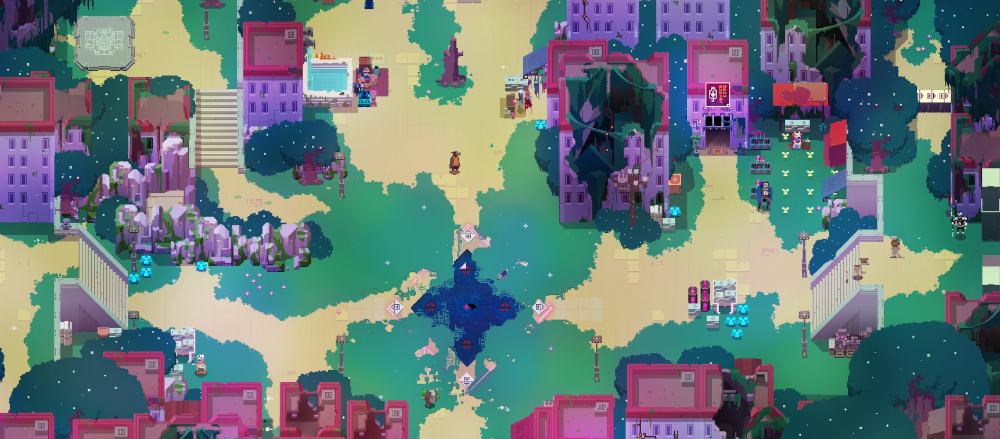

# hyper-map-stitcher

Python program using opencv to create big panoramas out of gameplay videos. Should work with every isometric video game

## How it works: high level breakdown

* Take every N-th frame from input video
* Do feature extraction on current frame
* Feature matching with features from last frame 
* Use matching vector to translate current frame and overlay with last frame
* Keep track of total vector (as origin of picture stays the same - for details see code)
* Repeat until video ends

## Install: TL;DR

* Python 3.8
* `pip install opencv-python opencv-contrib-python tqdm numpy`
* Check `batcher.py` for a usage example. Could also try interactive mode with `stitch.py` or the `gui_stitcher.py`

## Install: Detailed How-To

* Download and install Python 3.8. 
* During the installation, two things are important:
  * Install pip
  * Add Python and pip to $PATH
* Clone or download a zip of this repository, unzip
* Start a terminal in the unzipped directory (on windows: use file explorer to go to the directory, then top right -> File -> Windows PowerShell)
* Type `python --version`, this should just output `Python 3.8.X` on the terminal. Just to confirm the installation worked
* Then type `pip install opencv-python opencv-contrib-python tqdm numpy`. This will automatically download and install some dependencies that we need to run hyper-map-stitcher
* Now you will need a gameplay video out of which you want to create a panorama. Videos can get quite big and I don't want to put them into this repository, so you'll have to find or make one yourself. I use Open Broadcaster Studio for that, but explaining that here would be beyond the scope of this README. But there are good online tutorials on how to work with OBS.
* Once you have a video file, move it to the unzipped directory
* Open `hld.py`. Here you can set filenames for input and input. Set infile to the name of your video file, with quotation marks and file ending, and outfile to your desired filename, with the file ending `.png`
* Save the file
* In the terminal, type `python hld.py`. This should start the stitching process.

## What works

* Tested with Hyper Light Drifter, Age of Empires 2, which both work fine
* Also kind of works with top down 3D games. The matching is fine, but the resulting panorama is bad (since we can't do perspective transform, or the remaining frames won't line up)
* Computation is reasonably efficient, since only the current frame is compared with the last frame (instead of the whole panorama). Big memory requirements for big panoramas though.
* Can cut off static UIs. Dynamic UI elements might make the end result less appealing, but matching is robust enough to continue

## What doesn't work

* Parallax scrolling, which unfortunately a lot of 2D games use. In short: background and foreground of the scenerey move at different speeds, so their movement vector between frames is different. The matching gets confused. **This problem is super hard and probably won't be fixed, ever**. A possible solution would be to cluster vectors from the matching step, and then let the user decide. The end result will still not look perfect, but the user can decide if they want the foreground or background to be lined up.
* Alpha blending could help fix dynamic UI elements. But that would require a total rework of the panorama logic. It currently stores only three images: the current and last frame, and the temporary result (which new frames get attached to). Alpha blending is not that straight forward and requires custom code (since opencv doesn't provide it). Doing this fast and efficient will be the biggest challenge
* The current GUI sucks. I just slapped some shit together with tkinter. 